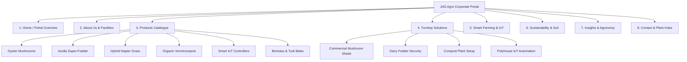

# JAS Agro Corporate Portal Redesign — Phase 1 Design Direction & Strategy

> **Document:** Phase 1 Design Direction & Architecture  
> **Target Scope:** JAS Agro Corporate & AgTech Portal (Excludes `shop.jas-agro`)  
> **Production Baseline:** [jasagro.com](https://jasagro.com/index.html)  
> **Current QA Reference:** [jas-agro.vercel.app](https://jas-agro.vercel.app/)  
> **Status:** Strategy & Foundation Approved — Ready for Phase 2 Component System

---

## 1. Verified Business Foundation

Through a thorough audit of the production site, codebase data files, and physical operational assets, the following **verified business truth** constitutes the permanent factual foundation of JAS Agro:

### A. Corporate Identity & Locations
* **Legal Operating Brand:** JAS Agro
* **Brand Tagline:** *Modern Agriculture. Sustainable Growth. Smarter Farming.*
* **Secondary Brand Proposition:** *Empowering Agriculture Through Sustainable Science & Precision Technology.*
* **Dedicated Mushroom Portal:** Chhatraka ([chhatraka.com](https://www.chhatraka.com/))
* **Corporate Headquarters & AgTech Center:**  
  `84/123, Sector 8, Sanganer, Pratap Nagar, Jaipur, Rajasthan 302033` *(Plus Code: RR39+C3 Jaipur)*
* **Biomass Processing Plant & Distribution Center:**  
  `Jas Agro Tudi Bales Plant & Warehouse, Amritsar-Jamnagar & Sangaria-Tibbi Highway Crossing, PFV8+8VW, Sangaria, 9 Sbn, Rajasthan 335063` *(Plus Code: PFV8+8VW Sangaria — 24/7 Operations Hub)*
* **Official Contact Channels:**  
  Phone: `+91 73729 26623` | Email: `info@jasagro.com`

---

### B. Core Product Lines (Verified Capabilities)
1. **Oyster Mushroom Cultivation (*Pleurotus ostreatus / Pleurotus sajor-caju*):**
   - High-yield, protein-rich gourmet mushroom spawn bags, dried mushrooms, and sterilized wheat/paddy straw substrate protocols.
   - Climate-controlled indoor fruiting chambers with high biological efficiency (80%–100% fresh yield per dry substrate).
2. **Bio-Nutrient Azolla Aquatic Super-Fodder (*Azolla pinnata*):**
   - Pure live starter strains and custom shade-net pond kits.
   - High crude protein content (25%–30%) designed to reduce commercial cattle and poultry feed costs by 20%–30%.
3. **High-Yield Hybrid Napier Grass (*Super Napier / CO-5*):**
   - Multi-cut perennial green fodder stem cuttings/slips delivering up to 6–8 cuts annually for 4–5 years continuous growth.
   - High biomass output (150–200 tons/acre/year potential) for dairy livestock and silage production.
4. **Bio-Active Organic Vermicompost (*Eisenia fetida* Castings):**
   - 100% pure organic humus decomposed by red earthworms from cattle dung and crop residues.
   - Bio-available NPK, beneficial mycorrhizae, and organic carbon for soil rejuvenation and moisture retention.
5. **Smart Farm IoT Environmental Controller:**
   - ESP32 dual-core microcontroller core with Wi-Fi and GSM connectivity.
   - Digital DHT22/SHT31 ambient temperature/humidity probes and capacitive soil moisture probes.
   - 4-channel opto-isolated solid-state relays for automated misters, ventilation exhaust fans, and irrigation pumps.
6. **Agricultural Biomass & Tudi Bales:**
   - High-density wheat straw and fodder biomass bales produced and distributed from the Sangaria plant hub.

---

### C. Commercial Services & Turnkey Solutions
* **Turnkey Oyster Mushroom Grow Rooms:** Thermal insulation design, micro-misting arrays, HEPA airflow, and agronomist protocol training.
* **Dairy Fodder Security Integration:** Azolla shallow shade-pond construction and Hybrid Napier estate planning.
* **Commercial Vermicomposting Plant Setup:** Shaded brick/HDPE beds, *Eisenia fetida* inoculation stock, and sieving setup.
* **AgTech IoT Field Telemetry:** Microcontroller installation, threshold alert triggers (WhatsApp/SMS), and local offline automated logic.

---

## 2. Data Requiring Client Verification

To preserve 100% credibility and avoid speculative marketing copy, the following parameters are classified as **Requiring Formal Client Confirmation**:

| Item | Working Prototype Reference | Action Required |
| :--- | :--- | :--- |
| **Year of Founding** | 2016 (in timeline mock) | Confirm exact incorporation year / operational commencement date. |
| **Active Grower Footprint** | "2,500+ Farmers & Dairies" | Validate current active farmer network or replace with verified operational scale. |
| **Annual Biomass Volume** | "450+ Tonnes Fodder / 120+ Tonnes Mushrooms" | Confirm certified annual processing metrics from Sangaria & Jaipur units. |
| **Active IoT Deployments** | "500+ Active Sensor Nodes" | Confirm total live field controller installations. |
| **Named Case Studies** | Gorakhpur (Mushroom), Karnal (Azolla), Patna (Napier) | Validate whether these are named commercial client deployments or illustrative models. |
| **Formal Accreditations** | FSSAI, NPOP Organic, ISO, Startup India | Obtain official registration numbers, licenses, and certificate badges. |
| **Official Social Handles** | YouTube, Instagram, LinkedIn, Facebook | Confirm exact verified corporate account URLs. |

---

## 3. Reference Analysis & Synthesis

Based on the 5 reference designs, we extract specific visual and functional patterns tailored for JAS Agro:

```
+-----------------------------------------------------------------------------------+
|                        SYNTHESIZED REFERENCE SYSTEM                               |
+-----------------------------------------------------------------------------------+
|  Sample 1 (Primary): Lush Agriculture, Hero Visuals, Modern Editorial Type       |
|  Sample 2 (Corporate): Timeline Storytelling, Quality Badges, Data Cards          |
|  Sample 3 (Services):  Structured Hairline Cards, Deliverables, Facility Maps     |
|  Sample 4 (AgTech):    Precision Hardware Cards, Live Telemetry Dials, Monospace  |
|  Sample 5 (Eco-Flow):  Step-by-Step Circular Agriculture & Sustainability Badges  |
+-----------------------------------------------------------------------------------+
```

### 1. Sample 1 — Primary Agricultural Design System (AgriCo / GreenHarvest)
* **What to Adopt:**
  - Full-bleed, warm, natural agricultural photography as the core visual anchor.
  - Bold, organic display typography (*"GROW SMARTER, FARM BETTER"*) with clean high-contrast legibility.
  - Multi-column card grids with clean rounded corners (`rounded-2xl` / `rounded-3xl`), circular action buttons, and emerald badges.
  - Interactive tabbed solutions section (*Increase Crop Yield, Reduce Water Usage, Improve Soil Health*).
* **Adaptation for JAS Agro:** Ground the visuals in authentic Indian agriculture (Oyster Mushroom indoor racks, Azolla green ponds, Napier grass fields, Sangaria biomass warehouse) rather than generic foreign crops.

### 2. Sample 2 — Corporate & About Storytelling (Agroton)
* **What to Adopt:**
  - High-authority corporate layout with clean editorial statistics overlay.
  - Milestone timeline showcasing the progression from organic research to AgTech IoT deployment.
  - Dedicated "Our Values" card row with minimal borders and high-contrast typography.
  - Authentic farmer/founder portraiture paired with certification trust markers.

### 3. Sample 3 — Service & Facility Layouts (MyGarden Structure)
* **What to Adopt:**
  - Crisp hairline card containers with subtle accent top-bars.
  - Dual-facility map transparency (Jaipur HQ + Sangaria Hub) featuring Plus Codes, hours, and direct routes.
  - Structured service deliverable checklists (`Custom Grow Room Layout`, `Pure Culture Spawn`, `Agronomist Training`).

### 4. Sample 4 — Premium AgTech & Telemetry Treatment (Agrone)
* **What to Adopt:**
  - High-contrast deep forest green backdrops (`#09110D`) for hardware sections.
  - High-precision presentation of hardware controllers (ESP32 microcontrollers, IP65 enclosures, digital probes, relay ports).
  - Clean monospace technical eyebrows (`Geist Mono` or `JetBrains Mono`) displaying live metrics (e.g. `24.2°C`, `86% RH`, `RELAY-1 ACTIVE`).
* **What to Avoid:** Do NOT make the site look like a consumer drone store or robotics vendor. Hardware is strictly in service of crop automation.

### 5. Sample 5 — Sustainability & Ecological Flow (Sonar Solar / Eco-Flow)
* **What to Adopt:**
  - Circular economy visual flow: Wheat Straw $\rightarrow$ Mushroom Substrate $\rightarrow$ Spent Compost $\rightarrow$ Soil Carbon Enrichment.
  - Glassmorphic environmental pill badges (`100% Chemical-Free`, `Water Conservation`).
  - Interactive accordion or step cards showcasing ecological and financial impact.

---

## 4. Final Information Architecture (Corporate Portal)



### Page-by-Page Breakdown:

1. **Home (`/`):**
   - **Hero:** Impactful agricultural background + primary slogan + dual CTAs (*Explore Solutions* / *Consult Agronomists*).
   - **Impact Pillars:** High-Protein Fodder, Gourmet Mushrooms, Bio-Organic Carbon, Smart IoT.
   - **Product Explorer:** Category tabs showcasing all 6 core products with biological specs.
   - **AgTech IoT Telemetry Spotlight:** Live simulation of ESP32 micro-climate monitoring and automated misting logic.
   - **Dual Facility Spotlight:** Jaipur Corporate Office & Sangaria Biomass Hub.
   - **Sustainability Banner:** Circular farming and zero-chemical soil health.
   - **Latest Insights & Agronomy Research:** 3 featured articles.
   - **Direct Inquiry Bar:** WhatsApp & phone action triggers.

2. **About Us (`/about`):**
   - **Mission & Vision:** Sustainable biological cultivation married with precision telemetry.
   - **Evolution Timeline:** Research foundation $\rightarrow$ Fodder expansion $\rightarrow$ Mushroom grow rooms $\rightarrow$ IoT deployment.
   - **Physical Facilities:** Detailed profiles of the Jaipur AgTech center and Sangaria biomass plant.
   - **Core Values:** Soil restoration, farmer economic viability, water conservation.

3. **Products (`/products`):**
   - Technical agricultural catalogue with filtering: *Mushrooms, Fodder, Soil Science, IoT Hardware, Biomass*.
   - Deep specification tables: Botanical names, crude protein %, harvest intervals, yield potential, packaging options.
   - Downloadable spec sheets and bulk procurement request actions.

4. **Solutions & Turnkey Setups (`/solutions`):**
   - End-to-end setups for commercial dairies, agri-entrepreneurs, and institutional polyhouses.
   - Step-by-step engineering pipeline: Site Assessment $\rightarrow$ Infrastructure & Misting $\rightarrow$ Culture Inoculation $\rightarrow$ Operational Training.

5. **Smart Farming & IoT (`/technology` or `/smart-farming`):**
   - Industrial hardware breakdown: ESP32 dual-core, DHT22 sensors, capacitive probes, 4-channel solid-state relays.
   - Interactive logic visualizer demonstrating automated misting and ventilation response to ambient conditions.
   - Offline autonomous reliability (continuous operation without internet).

6. **Sustainability & Soil Science (`/sustainability`):**
   - Circular agricultural diagram (Crop residue $\rightarrow$ Mushroom beds $\rightarrow$ Vermicompost $\rightarrow$ Rejuvenated topsoil).
   - Soil Organic Carbon restoration and chemical-free bio-protection methods.

7. **Insights & Knowledge Hub (`/insights`):**
   - Agronomist articles on mushroom cycles, Azolla feed ratios, Napier planting geometry, and soil microbiology.
   - Searchable and categorized knowledge base.

8. **Contact & Facilities (`/contact`):**
   - Comprehensive consultation inquiry form.
   - Interactive maps and Plus Codes for Jaipur HQ (`RR39+C3`) and Sangaria Plant (`PFV8+8VW`).
   - Direct phone, email, and one-tap WhatsApp agronomist connect.

---

## 5. Visual Design Direction

### Aesthetic Philosophy: *Earthy Modernism meets Precision AgTech*
The design must feel deeply connected to the land—rich, fertile, trustworthy, and organic—while possessing the crisp, disciplined elegance of high-grade modern engineering.

```
+------------------------------------------------------------------------------------+
|                                COLOR PALETTE TOKENS                                |
+------------------------------------------------------------------------------------+
|  Deep Forest Canvas:   #09110D (Deep fertile charcoal-green dark surface)          |
|  Rich Agricultural:    #0B2E1E (Primary corporate deep green)                      |
|  Crop Emerald:         #059669 / #10B981 (Active growth, buttons, live indicators) |
|  Warm Harvest Amber:   #D97706 / #F59E0B (Seed, sunlight, and highlight badges)    |
|  Natural Parchment:    #FAFBF7 (Subtle warm off-white light canvas)                |
|  Translucent Hairline: rgba(16, 185, 129, 0.15) (Subtle structural borders)       |
+------------------------------------------------------------------------------------+
```

### Key Visual Attributes:
* **Photography:** Rich, authentic imagery of Indian crops, green forage, clean indoor mushroom racks, and robust physical hardware. No artificial AI stock renders or futuristic sci-fi fields.
* **Typography:**
  - **Headings & Display:** `Plus Jakarta Sans` or `Inter` (Font-weight 700/800, tight letter-spacing `-0.025em`).
  - **Body Copy:** `Inter` (Regular/Medium 400/500, line-height 1.65 for superior editorial readability).
  - **Technical Labels & Telemetry:** `Geist Mono` or `JetBrains Mono` (Uppercase, tracked `+0.05em`).
* **Card & Section Surfaces:**
  - 16px to 24px rounded corners (`rounded-2xl` / `rounded-3xl`).
  - 1px hairline border with soft translucent green tinting.
  - Subtle layered depth (diffuse 20px blur shadows, zero harsh black drop-shadows).

---

## 6. Design System Direction

### 1. Navigation (Navbar)
* **Floating Glassmorphic Container:** Pill or rounded bar (`rounded-2xl`) with backdrop blur (`backdrop-blur-md`).
* **Primary Navigation Links:** Home, About, Products, Solutions, Smart Farming, Sustainability, Insights, Contact.
* **Action Cluster:** Language switcher (EN / HI), Dark/Light theme toggle, and high-visibility "Get a Quote" / "Shop" external trigger.

### 2. Hero Presentation
* **Structure:** Deep editorial layout with full-width agricultural visual canvas, dark green gradient vignette for text legibility, dual-action button group, and a floating trust badge strip.
* **Tone:** Grounded, authoritative, and welcoming to both large agri-enterprises and local farmers.

### 3. Product & Service Cards
* **Grid Layout:** 3-column desktop / 1-column mobile.
* **Card Structure:** Top image container (with zoom on hover) $\rightarrow$ Category badge tag $\rightarrow$ Botanical/Technical subtitle $\rightarrow$ Key bullet metrics $\rightarrow$ Action link with arrow icon.

### 4. AgTech / IoT Telemetry Component
* **Visual Frame:** Dark-slate/charcoal container resembling an industrial control console.
* **Telemetry Dials:** Crisp numerical values for Temperature (°C), Relative Humidity (%), Soil Moisture (%), and Relay Status (ON/OFF).
* **Interactive Element:** Slider or toggle to test automated relay misting triggers based on ambient threshold logic.

### 5. Call-to-Action (CTA) Banners
* **Layout:** Full-width deep forest gradient banner with subtle topographical or foliage watermark.
* **Direct Actions:** Primary emerald button for consultation booking + secondary WhatsApp quick-chat button.

---

## 7. Motion & Interaction Direction

* **Philosophy:** Motion must be purposeful, organic, and restrained—reflecting natural growth and technical precision, never frivolous.
* **Hover Transitions:** Smooth 200ms–300ms transitions (`cubic-bezier(0.16, 1, 0.3, 1)`). Gentle 2px upward elevation on cards.
* **Scroll Reveals:** Subtle fade-in with 12px vertical slide for section headers and staggered card grids.
* **Interactive Tabs & Accordions:** Instant layout transitions with zero layout shift.
* **Strict Rule:** Avoid aggressive looping bouncy animations, spinning 3D cubes, or parallax effects that cause motion sickness.

---

## 8. Responsive Direction

* **Desktop (1024px+):** Generous whitespace (padding 64px–96px), 3-column product grids, side-by-side editorial text/image layouts.
* **Tablet (768px–1023px):** 2-column balanced grids, collapsing navigation menu with drawer, touch-friendly tab selectors.
* **Mobile (<768px):**
  - Full single-column vertical flow with minimum touch target size of 48px.
  - Sticky bottom contact bar for quick WhatsApp/Phone inquiries.
  - Horizontal scrolling pill filters for product and insight categories to prevent vertical stacking bloat.

---

## 9. Things We Must Avoid (Anti-Patterns)

| Category | Forbidden Pattern | Approved JAS Agro Replacement |
| :--- | :--- | :--- |
| **Industry Identity** | Making the company look like a generic SaaS startup or crypto project. | Grounded, authentic agricultural enterprise with real physical assets and crops. |
| **Hardware Copy** | Claiming autonomous AI drone fleets or heavy robotics. | Genuine ESP32 microcontroller telemetry and automated relay misting controllers. |
| **Data Integrity** | Fabricating customer counts, fake certifications, or speculative ROI claims. | Verified botanical specifications, real cultivation guides, and qualitative value pillars. |
| **Imagery** | Generic American wheat monoculture or abstract 3D floating shapes. | Authentic Indian agriculture, oyster mushroom racks, Azolla ponds, and Sangaria warehouse. |
| **Shop Boundaries** | Blending e-commerce cart flows into the corporate portal. | Clean external link routing to `shop.jas-agro` as an independent commerce portal. |

---

## 10. Phase 2 Recommendations & Implementation Roadmap

Upon client confirmation of this design direction, Phase 2 will execute along the following clean sequence:

```
[Phase 1: Foundation Approved]
             │
             ▼
[Phase 2.1: Design Tokens & Base Theme Update]
   • Refine CSS custom properties for Deep Forest, Crop Emerald, and Warm Harvest palettes.
   • Ensure dark/light mode parity with #09110D and #FAFBF7 canvases.
             │
             ▼
[Phase 2.2: Core Component Overhauls]
   • Rebuild Navbar & Footer to reflect the refined 8-page architecture.
   • Refactor HeroSection with Sample 1 editorial layout.
   • Build the new AgTech Console component (ESP32 hardware visualization).
             │
             ▼
[Phase 2.3: Page Template Refinement]
   • Update Home (`/`), About (`/about`), Products (`/products`), Solutions (`/solutions`),
     Technology (`/technology`), Sustainability (`/sustainability`), and Contact (`/contact`).
             │
             ▼
[Phase 2.4: Quality Assurance & Cross-Device Validation]
   • Validate bilingual English/Hindi copy across all components.
   • Test responsive layouts across mobile, tablet, and widescreen viewports.
```

---
*Phase 1 Strategy Document Completed — Prepared for Client Review.*
