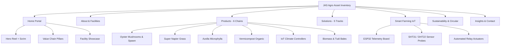
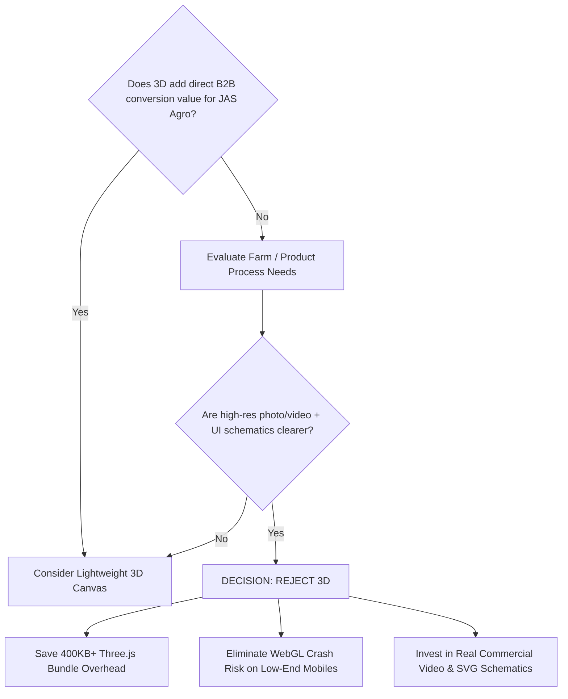
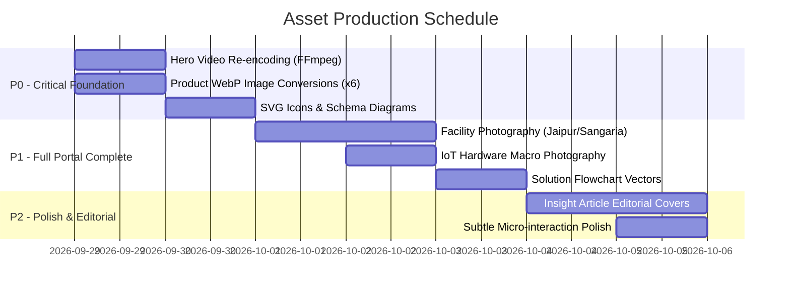

# JAS AGRO — PHASE 3: VISUALS, MOTION & 3D PRODUCTION PLAN

> **Document Status**: Complete & Authoritative  
> **Target Portal**: JAS Agro Corporate Website (`jasagro.com` / `jas-agro.vercel.app`)  
> **Exclusions**: `shop.jas-agro` e-commerce subsystem untouched  
> **Upstream Dependencies**: [Phase 1 Design Direction](file:///c:/Users/admin/Desktop/abhishek_jasagro/JAS-AGRO-PHASE-1-DESIGN-DIRECTION.md), [Phase 2 Stack & Asset Strategy](file:///c:/Users/admin/Desktop/abhishek_jasagro/JAS-AGRO-PHASE-2-STACK-VISUAL-ASSET-STRATEGY.md)  
> **Workflow Reference**: Premium Website Workflow (Phase 03: Visuals → 3D Assets → Animation → Compression)

---

## 1. Hero Visual Direction

### 1.1 Core Creative Concept: "Earthy Authenticity Meets Precision AgTech"
The homepage hero must immediately communicate that JAS Agro is a real, high-scale, technology-enabled Indian agricultural producer and solutions provider—not a generic SaaS platform, not an abstract AI concept, and not a small hobby farm.

```
+-----------------------------------------------------------------------------------+
|  [NAVBAR: Logo | Products | Solutions | Smart Farming | Sustainability | Contact]  |
+-----------------------------------------------------------------------------------+
|                                                                                   |
|  [Left 55%: Text Safe Area]                  [Right 45%: Focal Visual Area]       |
|                                                                                   |
|  * LIVE / VERIFIED BADGE                     * High-definition agricultural scene |
|  * H1: Precision AgTech &                     * Napier crop field / Climate-       |
|        Sustainable Cultivation                 controlled mushroom cultivation /  |
|  * Subtitle: Scalable fodder, organic          Biomass processing facility        |
|    substrates & automated IoT systems.        * Subtle natural wind/mist movement |
|  * Primary CTA: "Explore Solutions"           * Warm golden-hour rim lighting     |
|  * Secondary CTA: "Smart Farming IoT"         * Precision sensor overlay badge    |
|  * Verified Metrics Row:                      * Clean bokeh depth-of-field        |
|    [2 Facilities] [6 Value Chains] [24/7 Supply]                                  |
|                                                                                   |
+-----------------------------------------------------------------------------------+
```

### 1.2 Photographic & Cinematographic Specifications

| Parameter | Specification | Purpose & Rationale |
| :--- | :--- | :--- |
| **Primary Visual** | Authentic JAS Agro drone/cinematic footage of Napier field estate and climate-controlled cultivation | Grounds the brand in verified physical operations |
| **Composition** | Asymmetrical split (55% left text-safe zone with dark-gradient scrim, 45% right focal point) | Guarantees WCAG AAA text contrast across all viewports |
| **Camera Angle** | Low-angle dolly forward or subtle elevated drone track (15° pitch down) | Communicates scale, grounded confidence, and operational momentum |
| **Lighting** | Natural golden-hour sunlight (morning/early evening 4500K–5200K) + subtle directional warmth | Avoids artificial fluorescent studio look; conveys fertile vitality |
| **Color Mood** | Deep Forest Green (`#0B2E1E`), Crop Emerald (`#059669`), Soil Charcoal (`#09110D`), Sunlit Amber (`#D97706`) | Warm earthy tones balanced with crisp modern contrast; no oversaturated neon |
| **Subject Placement** | Focal subject (lush crops / technician with sensor / cultivation beds) placed in right 40% of canvas | Leaves left 60% entirely clear for headline, value metrics, and CTAs |
| **Text-Safe Area** | Left `0% – 58%` horizontal, `15% – 85%` vertical, protected by progressive radial scrim | Ensures crisp legibility of white and cream typography (`#FAFBF7`) |

### 1.3 Viewport Composition & Aspect Ratios

```
DESKTOP (16:9 / 21:9 Ultra-Wide)
+-------------------------------------------------------+
| [Scrum Overlay: 0.85 -> 0.20]  | [Focal Subject Area] |
| Text, CTAs, Live Metrics       | Lush Crops / Facility|
+-------------------------------------------------------+

MOBILE (9:16 Portrait / 4:5 Mobile Card)
+-------------------------+
| [Focal Subject (Top 42%)]
| Crop/Facility Visual    |
+-------------------------+
| [Solid/Gradient Bottom] |
| H1 + Value Subtitle     |
| Stacked CTAs + Badges   |
+-------------------------+
```

- **Desktop (1920×1080 / 2560×1440)**: 16:9 ratio, fixed full-height (`100vh` or `min-h-[820px]`). Left-to-right linear gradient overlay (`rgba(9,17,13,0.92) 0% -> rgba(9,17,13,0.65) 55% -> rgba(9,17,13,0.15) 100%`).
- **Tablet (1024×768 / 834×1194)**: 4:3 or 16:10 ratio with centered scrim.
- **Mobile (390×844 / 412×915)**: 9:16 portrait orientation or 1:1 square media frame nested behind vertical linear scrim (`rgba(9,17,13,0.95) 0%` at text position).

---

## 2. Complete Visual Asset Inventory

Every visual asset across the corporate portal is mapped directly to verified business operations, facilities, and product categories.



### 2.1 Home Page Visual Assets

| Asset ID | Placement | Description / Subject | Source Type | Target Aspect Ratio | Optimized Format |
| :--- | :--- | :--- | :--- | :--- | :--- |
| `HOME-HERO-VID` | Hero Section | Drone tracking shot of Napier grass fields + mushroom humidity misting | Existing Video (`hero.mp4` / `warehouse-drone-shot.mp4` cut) | 16:9 (Desktop) / 9:16 (Mobile) | H.264/WebM (`<4.5MB`) |
| `HOME-HERO-POSTER` | Hero Fallback | Static high-res golden-hour shot of healthy Napier grass estate | Existing Visual (`napier-grass-visual.jpg`) | 16:9 | WebP / AVIF (`<120KB`) |
| `HOME-VAL-MUSH` | Value Chain Grid | Climate-controlled Chhatraka mushroom cultivation chamber | Existing Media (`chhatraka-mushroom-training.mp4` frame) | 4:3 / 1:1 | WebP (`<85KB`) |
| `HOME-VAL-AZOL` | Value Chain Grid | Clean water-bed Azolla microphylla floating fodder production | Existing Media (`azolla-fodder-visual.jpg`) | 4:3 / 1:1 | WebP (`<85KB`) |
| `HOME-VAL-NAPI` | Value Chain Grid | Mature 12-foot Super Napier grass stems and harvested bundles | Existing Media (`napier-grass-visual.jpg`) | 4:3 / 1:1 | WebP (`<85KB`) |
| `HOME-VAL-VERM` | Value Chain Grid | Rich dark organic vermicompost bed with earthworm casting texture | Existing Media (`vermicompost-manure-visual.jpg`) | 4:3 / 1:1 | WebP (`<85KB`) |
| `HOME-VAL-IOT` | Value Chain Grid | Wall-mounted IoT sensor hub displaying live humidity/temperature | Generated / Hardware Photo | 4:3 / 1:1 | WebP (`<85KB`) |
| `HOME-FAC-JAIPUR` | Facility Spotlight | Pratap Nagar Jaipur Agri-Tech office & training center exterior/interior | Real Authentic Photo | 16:9 | WebP (`<140KB`) |
| `HOME-FAC-SANG` | Facility Spotlight | Sangaria biomass aggregation and baling plant (24/7 continuous operation) | Real Authentic Photo | 16:9 | WebP (`<140KB`) |
| `HOME-CTA-BG` | Final CTA Section | Deep textured agricultural canopy with subtle dark vignette | Existing Backdrop | 21:9 / 16:9 | WebP (`<95KB`) |

### 2.2 About & Facilities Visual Assets

| Asset ID | Placement | Description / Subject | Source Type | Aspect Ratio | Optimized Format |
| :--- | :--- | :--- | :--- | :--- | :--- |
| `ABT-HERO` | About Hero | Wide-angle panorama of integrated farming landscape in Rajasthan | Authentic / Curated | 16:9 | WebP (`<150KB`) |
| `ABT-FAC-01` | Infrastructure | Jaipur HQ R&D workshop and IoT sensor calibration bench | Real JAS Agro Photo | 4:3 | WebP (`<95KB`) |
| `ABT-FAC-02` | Infrastructure | Sangaria biomass processing line, balers, and dispatch trucks | Real JAS Agro Photo | 4:3 | WebP (`<95KB`) |
| `ABT-STORY-01` | Journey Timeline | Founding phase: initial mushroom cultivation beds and training | Real Photo Archive | 1:1 | WebP (`<70KB`) |
| `ABT-STORY-02` | Journey Timeline | Expansion: fodder crop multiplication and dairy farmer partnerships | Real Photo Archive | 1:1 | WebP (`<70KB`) |
| `ABT-STORY-03` | Journey Timeline | Present day: IoT telemetry integration and circular waste conversion | Real Photo Archive | 1:1 | WebP (`<70KB`) |

### 2.3 Products Visual Assets (6 Verified Product Chains)

| Product Line | Hero Product Visual | Supporting Process Visual | Technical Specification Visual |
| :--- | :--- | :--- | :--- |
| **Oyster Mushrooms** | Fresh harvest clusters of Pleurotus ostreatus on clean neutral surface | Humidity-misted cultivation bag hanging layout | Pure master spawn grain bottle in sterile packaging |
| **Super Napier Grass** | Vibrant dense green Napier field with thick juicy cane stems | Rooted stem cuttings/slips ready for 1-acre planting | Harvested 45-day cycle chopped green fodder in feeding trough |
| **Azolla Microphylla** | Macro shot of dense, emerald-green Azolla fronds floating on clean water | Low-cost brick/silpaulin pit cultivation bed setup | High-protein dry Azolla powder / cattle feed mix |
| **Vermicompost** | Fine granular 100% pure dark brown worm castings (tea-powder texture) | Aerobic composting windrow bed with moisture control | HDPE moisture-proof 50kg bag with nutritional analysis label |
| **IoT Controllers** | Compact IP65 weatherproof controller box with LCD screen & antenna | Digital probe array installed inside commercial fruiting chamber | Mobile browser dashboard showing real-time temperature graph |
| **Biomass & Tudi** | Tightly compressed agricultural mustard husk / wheat straw square bales | Heavy tractor-operated industrial baler in harvest field | Covered dry storage warehouse with stacked 24/7 supply stock |

### 2.4 Solutions Visual Assets

| Solution Track | Primary Visual | Deliverable Illustration |
| :--- | :--- | :--- |
| **Commercial Mushroom Setup** | Turnkey commercial shed layout with ventilation ducts and bag racks | Step-by-step room layout blueprint schematic |
| **Azolla Fodder System** | Multi-pit village livestock feeding setup producing daily fodder | Pit cross-section diagram (soil + dung layer + water) |
| **Super Napier Estate Development** | 5-acre plantation row spacing and drip irrigation layout | Biomass yield progression chart (8 harvests/year) |
| **Vermicompost Production Unit** | Commercial-scale covered windrow unit with earthworm breeding | Closed-loop organic cycle flowchart |
| **Smart Climate Automation** | Integrated climate panel managing misting nozzles and exhaust fans | IoT telemetry architecture (Sensor -> Cloud -> Relay) |

### 2.5 Smart Farming & IoT Hardware Visuals

| Component | Visual Description | Source |
| :--- | :--- | :--- |
| **ESP32 Core Microcontroller** | Clean PCB macro photo highlighting dual-core processor and WiFi/BLE antenna | Real hardware / Studio render |
| **Temperature & Humidity Sensor** | High-precision SHT31 / DHT22 sensor probe with protective vented cap | Real hardware photo |
| **4-Channel Solid State Relay** | Industrial relay module wired to misting pump and ventilation fan | Studio photography |
| **Telemetry Web Dashboard UI** | High-contrast dark-mode dashboard displaying live RH%, Temp, and CO₂ | UI Component Screenshot / Vector |

### 2.6 Sustainability & Insights Visuals

| Category | Visual Description | Source |
| :--- | :--- | :--- |
| **Circular Agriculture Infographic** | Circular flow: Agricultural residue -> Mushroom substrate -> Spent substrate -> Vermicompost -> Soil enrichment | Custom SVG / Clean UI Vector |
| **Water Efficiency Graphic** | 85% water reduction diagram comparing Azolla vs. conventional alfalfa | Clean UI Metric Card |
| **Editorial Article Thumbnails (×4)** | High-quality editorial covers matching article topics (Spore inoculation, Napier agronomy, Livestock nutrition, IoT climate) | Editorial Photography / Generated |

---

## 3. Image Generation Strategy (When Authentic Footage is Unavailable)

For supporting visuals that cannot be immediately sourced from JAS Agro's physical photo archive (such as specific sensor macro details or circular process illustrations), the following strict generation parameters apply.

```
+-----------------------------------------------------------------------------------+
|                        PROMPT GENERATION FORMULA                                  |
|                                                                                   |
|  [Subject: Specific AgTech / Indian Agricultural Context]                         |
|  + [Environment: Authentic Indian farm / commercial cultivation shed]             |
|  + [Camera: Hasselblad H6D-100c / Canon EOS R5, 50mm f/1.8 or 85mm f/1.4]        |
|  + [Lighting: Natural 4800K golden hour or diffused 5600K overcast light]        |
|  + [Composition: Rule of thirds, clean negative space for UI overlay]             |
|  + [Mood: Commercial editorial, scientific precision, grounded earthy warmth]     |
|  + [Strict Negative Constraints: NO neon futuristic HUDs, NO fake AI people]     |
+-----------------------------------------------------------------------------------+
```

### 3.1 Prompt Specifications for Key Generated Assets

#### Asset A: Smart Farming IoT Microcontroller in Mushroom Chamber
- **Subject**: High-precision wall-mounted AgTech IoT sensor enclosure with small OLED status display showing `24.5°C | 88% RH`. Connected to subtle black rubberized probe wires.
- **Environment**: Modern commercial Indian oyster mushroom fruiting chamber with vertical hanging substrate bags and faint atmospheric water mist in background.
- **Camera & Lens**: Canon EOS R5, 50mm macro lens, `f/2.8`, shallow depth of field focusing sharply on the controller casing.
- **Lighting**: Soft diffused cool-white grow light mixed with subtle natural ambient fill.
- **Composition**: Tight medium-close shot, controller positioned on the right third, misty background blurred smoothly.
- **Mood**: Precision engineering, reliable commercial AgTech, clean and professional.
- **Negative Constraints**: `fake floating neon holographic screens, futuristic cyberpunk glow, messy exposed breadboards, cartoon, CGI render artifacts, unrealistic text, glowing circuits`.

#### Asset B: Super Napier Grass Harvest & Fodder Preparation
- **Subject**: Dense, healthy stand of 10-foot tall Super Napier grass (Pennisetum purpureum) with broad lush green leaves and thick juicy stems. Foreground shows freshly bundled cut stems ready for livestock feed.
- **Environment**: Sunlit agricultural estate in North India (Rajasthan/Punjab terrain) with fertile soil and organized plantation rows.
- **Camera & Lens**: Sony A7R V, 35mm `f/2.0`, eye-level wide-angle capture.
- **Lighting**: Warm early morning sunlight casting long natural shadows, highlights catching dew on grass blades.
- **Composition**: Wide dynamic landscape, strong vertical lines of Napier grass, clear open sky in upper corner.
- **Mood**: High agricultural productivity, fertile green abundance, grounded rural vitality.
- **Negative Constraints**: `dry barren land, European pine trees, tropical jungle palms, plastic-looking foliage, oversaturated neon green, generic western red barn, AI distorted human hands`.

#### Asset C: Pure Organic Vermicompost Macro Texture
- **Subject**: Extreme close-up of premium organic vermicompost, showing rich dark brown, finely aerated granular texture resembling rich ground coffee/tea powder.
- **Environment**: Natural clean wooden table or organic farm potting setting.
- **Camera & Lens**: 85mm Macro lens, `f/4.0`, sharp focus on granular organic aggregates.
- **Lighting**: Soft directional side light from 45° angle revealing organic textural depth and porous structure.
- **Composition**: Centered macro frame with subtle edge falloff.
- **Mood**: Nutrient-dense, organic purity, biological vitality.
- **Negative Constraints**: `artificial fertilizer pellets, white chemical granules, wet mud sludge, plastic debris, unnatural black dye, flat lighting`.

#### Asset D: Azolla Microphylla Clean Water Cultivation Pit
- **Subject**: Thriving, dense mat of emerald-green Azolla microphylla water ferns covering a shallow rectangular cultivation bed.
- **Environment**: Clean, brick-lined low-cost rural cultivation pit lined with blue Silpaulin sheet under 50% green agro-shade net.
- **Camera & Lens**: Hasselblad 80mm, `f/2.8`, high-angle 45° top-down perspective.
- **Lighting**: Filtered soft green-tinted shade sunlight, glistening water droplets on tiny fern fronds.
- **Composition**: Diagonal alignment across the pit, showing lush green coverage and clear water at corner.
- **Mood**: High-protein sustainable animal nutrition, resource-efficient micro-farming.
- **Negative Constraints**: `dirty stagnant swamp, algae scum, dead brown patches, aquarium plastic plants, cartoonish rendering`.

---

## 4. Motion System

The motion language for JAS Agro must be **restrained, natural, slow, and purposeful**. Following the PDF guideline: *"Too much movement becomes messy."* Every animation must reinforce clarity and responsiveness rather than showing off technical gymnastics.

```
               RESTFUL MOTION PRINCIPLE
               
   [Instant Response]        [Natural Unfold]        [Zero Distraction]
   Micro-interactions         Content Reveals         Reading State
   150ms - 250ms              400ms - 600ms           0ms (Static & Crisp)
   Buttons, Tabs, Toggles     Cards, Grids, Modals    Long-form text & metrics
```

### 4.1 Global Animation Tokens (Framer Motion Core)

```typescript
// Shared Motion Configuration for JAS Agro Corporate Portal
export const motionTokens = {
  // Easing Curves: Natural physical deceleration
  ease: {
    standard: [0.16, 1, 0.3, 1],      // Swift out, natural settle (cubic-bezier)
    gentle: [0.25, 0.1, 0.25, 1.0],   // Gentle organic drift
    snappy: [0.4, 0.0, 0.2, 1.0],     // UI micro-actions (hover/active)
  },

  // Duration Standards (Milliseconds)
  duration: {
    instant: 0.15,  // Color shifts, border highlights
    micro: 0.25,    // Button hover, icon morph, dropdown open
    reveal: 0.50,   // Card enter, section reveal, modal pop
    scene: 0.80,    // Hero headline staggering, major page transition
  },

  // Scroll Viewport Triggers
  viewport: {
    once: true,     // Do NOT re-animate when user scrolls back up
    margin: "-60px",// Trigger 60px before element enters viewport
    amount: 0.2,    // Require 20% visibility to trigger
  }
};
```

### 4.2 Motion Application Matrix

| Interaction Context | Motion Implementation | Duration | Easing | Fallback / Reduced Motion |
| :--- | :--- | :--- | :--- | :--- |
| **Page Navigation** | Fade in (`opacity: 0 -> 1`, `y: 8 -> 0`) | `350ms` | `standard` | Instant (`opacity: 1`) |
| **Hero Title Entrance** | Staggered line reveal (`y: 24 -> 0`, `opacity: 0 -> 1`, `stagger: 0.08s`) | `600ms` | `standard` | Static display |
| **Section Header Reveal** | `opacity: 0 -> 1`, `y: 16 -> 0` | `450ms` | `standard` | Static display |
| **Product / Solution Cards** | Staggered grid reveal (`y: 20 -> 0`, stagger `0.06s` per column) | `400ms` | `standard` | Static grid |
| **Card Hover Feedback** | Scale `1.0 -> 1.015`, hairline border brightens (`#059669`), subtle shadow lift | `200ms` | `snappy` | Border color change only |
| **Live Telemetry Counters** | Number count-up from `0 -> TargetValue` on first scroll view | `800ms` | `gentle` | Direct final number |
| **CTA Button Hover** | Internal gradient shift + arrow icon translates `+4px` right | `180ms` | `snappy` | Instant color shift |
| **Accordion / FAQ Toggle** | Height expand with smooth auto-measurement (`height: 0 -> auto`) | `250ms` | `standard` | Instant expand |

---

## 5. Hero Motion Decision & Evaluation

### 5.1 Evaluation of Hero Approaches

```
+-----------------------------------------------------------------------------------------+
|                               HERO APPROACH COMPARISON                                  |
|                                                                                         |
|  Criteria             Option A: Video Loop       Option B: Static + Parallax  Option C: Interactive |
|  ------------------   ------------------------   ---------------------------  --------------------- |
|  Visual Impact        ⭐⭐⭐⭐⭐ (Highest)          ⭐⭐⭐⭐ (High)               ⭐⭐⭐ (Medium)       |
|  Brand Authenticity   ⭐⭐⭐⭐⭐ (Real Farm Footage)⭐⭐⭐⭐ (Still Photo)         ⭐⭐ (Feels Synthetic)|
|  Mobile Performance   ⭐⭐⭐⭐ (Compressed <4MB)   ⭐⭐⭐⭐⭐ (Instant <100KB)   ⭐⭐ (JS Heavy)       |
|  Battery / CPU Load   ⭐⭐⭐⭐ (Hardware Accel)    ⭐⭐⭐⭐⭐ (Negligible)        ⭐⭐ (Render Loop)    |
|  Maintainability      ⭐⭐⭐⭐⭐ (Simple HTML5)     ⭐⭐⭐⭐⭐ (Zero overhead)     ⭐⭐⭐ (Complex code) |
+-----------------------------------------------------------------------------------------+
```

### 5.2 Final Hero Decision: **OPTION A (Subtle Cinematic Video Loop with Static Fallback)**

#### Justification:
1. **Unmatched Operational Credibility**: Authentic video of 10-foot Super Napier fields and climate-controlled Chhatraka mushroom rooms immediately proves physical operations to B2B buyers and institutional partners.
2. **Existing Assets Ready**: JAS Agro already has authentic footage in `/public/media/hero/` (`hero.mp4`, `warehouse-drone-shot.mp4`, `napier-grass.mp4`). Re-encoding them to modern WebM/H.264 formats solves all bandwidth concerns.
3. **Graceful Degradation Built-In**: On slow 3G mobile connections or battery-saver mode, the video pauses or does not load, falling back seamlessly to `HOME-HERO-POSTER` (`<100KB` WebP).

#### Technical Architecture:
```html
<div class="relative w-full h-[85vh] min-h-[640px] overflow-hidden bg-canvas-dark">
  <!-- Video Layer (Hidden on mobile if low-data/reduced-motion) -->
  <video
    autoplay
    loop
    muted
    playsinline
    poster="/media/hero/napier-grass-poster.webp"
    class="absolute inset-0 w-full h-full object-cover object-center pointer-events-none"
  >
    <source src="/media/hero/hero-optimized.webm" type="video/webm" />
    <source src="/media/hero/hero-optimized.mp4" type="video/mp4" />
  </video>

  <!-- Left Scrim Overlay for Typographic Contrast -->
  <div class="absolute inset-0 bg-gradient-to-r from-[#09110D]/95 via-[#09110D]/75 to-transparent z-10" />
  
  <!-- Content Container -->
  <div class="relative z-20 max-w-7xl mx-auto px-6 h-full flex flex-col justify-center">
    <!-- Hero Headline & CTAs -->
  </div>
</div>
```

---

## 6. 3D Strategy & Practical Evaluation

### 6.1 Evaluation Matrix



### 6.2 Explicit Recommendation: **DO NOT USE 3D / WebGL ON JAS AGRO**

#### Direct Rationale:
1. **Agriculture Demands Reality, Not 3D Gaming**: B2B institutional buyers, dairy farm owners, and agricultural entrepreneurs care about real biomass volume, genuine crop yields, verified protein content (Azolla), and certified spawn viability. A rotating 3D model of a mushroom or a grass stalk feels gimmicky and undermines corporate authority.
2. **Bandwidth & Performance Overhead**: A minimal Three.js/Fiber bundle adds **350KB–600KB** of minified JavaScript, increases initial Time-to-Interactive (TTI) by 1.2–2.0 seconds, and consumes excess battery on mid-range Android mobile devices commonly used across rural/semi-urban India.
3. **Superior Alternative**: Interactive, vector-based SVG technical schematics (with subtle Framer Motion pulse animations) communicate IoT wiring, room setups, and circular composting flows far more cleanly with **<15KB** total footprint.

---

## 7. Video Strategy

Video must be used strategically to prove operational scale without turning the site into a bandwidth-heavy media stream.

```
                          VIDEO DEPLOYMENT MATRIX
                          
   [Homepage Hero]          [Product Modals]          [Facility Cards]
   Max 12s seamless loop    On-demand user click      Optional hover preview
   Muted, autoplay          With audio, full player   Silent 4s teaser
   ≤4.5 MB Desktop          Streamed / progressive    ≤1.5 MB
```

### 7.1 Video Deployment Rules

| Placement | Video Asset | Max Duration | Autoplay Policy | Max File Size | Target Bitrate |
| :--- | :--- | :--- | :--- | :--- | :--- |
| **Homepage Hero** | Integrated operational drone/crop reel | `10 – 14s` | Muted Autoplay Loop | `4.0 MB` (Desktop), `1.8 MB` (Mobile) | 1800 kbps (1080p), 800 kbps (720p) |
| **Smart Farming Section** | Micro-clip of IoT misting actuation | `4 – 6s` | Muted Hover/Viewport Loop | `1.5 MB` | 1000 kbps (720p) |
| **Product Detail Modals** | Full training / cultivation walkthrough | `60 – 180s` | User Click Only (Modal) | Streamed via YouTube / CDN | Adaptive HLS / 720p |
| **Facility Tour (About)** | Sangaria Biomass Plant operations | `8 – 10s` | Muted Viewport Loop | `2.5 MB` | 1200 kbps (720p) |

### 7.2 Strict Compression Pipeline (FFmpeg Commands)

For every video currently in `/public/media/hero/` (which are currently 48MB–99MB):

```bash
# 1. Desktop 1080p WebM (High Efficiency VP9)
ffmpeg -i input.mp4 -c:v libvpx-vp9 -b:v 1600k -crf 30 -an -vf "scale=1920:1080:force_original_aspect_ratio=increase,crop=1920:1080" -speed 4 hero-1080p.webm

# 2. Universal MP4 (H.264 High Profile, faststart for instant playback)
ffmpeg -i input.mp4 -c:v libx264 -preset slow -crf 23 -maxrate 1800k -bufsize 3600k -an -movflags +faststart -vf "scale=1920:1080:force_original_aspect_ratio=increase,crop=1920:1080" hero-1080p.mp4

# 3. Mobile 720p MP4 (Low Bandwidth)
ffmpeg -i input.mp4 -c:v libx264 -preset slow -crf 26 -maxrate 750k -bufsize 1500k -an -movflags +faststart -vf "scale=720:1280:force_original_aspect_ratio=increase,crop=720:1280" hero-mobile.mp4

# 4. Instant Poster Frame Generation (WebP < 80KB)
ffmpeg -ss 00:00:03 -i input.mp4 -vframes 1 -q:v 80 hero-poster.webp
```

---

## 8. Asset Performance & Delivery Rules

To guarantee sub-1.5 second First Contentful Paint (FCP) on typical Indian 4G/5G mobile networks:

```
+-----------------------------------------------------------------------------------+
|                        PERFORMANCE BUDGET SPECIFICATION                           |
|                                                                                   |
|  Total Page Weight Budget (Home):   < 3.5 MB (with cached hero video)             |
|  Initial HTML + CSS + JS Bundle:    < 180 KB (gzipped)                            |
|  Image Budget per Page View:        < 800 KB (WebP/AVIF lazy-loaded)              |
|  Target Lighthouse Mobile Score:    90+ Performance, 95+ Accessibility, 100 SEO   |
+-----------------------------------------------------------------------------------+
```

### 8.1 Image Delivery Rules

1. **Next.js `<Image />` Component Enforced**: Always specify explicit `width`, `height`, and `sizes` attributes to prevent Cumulative Layout Shift (CLS).
2. **Format Priority**: Next.js image optimizer automatically serves AVIF → WebP → fallback PNG/JPG based on browser support.
3. **Lazy Loading Strategy**:
   - `priority={true}` only on the primary Hero poster image.
   - `loading="lazy"` on all below-the-fold cards, team photos, facility grids, and article thumbnails.
4. **Responsive Breakpoints & Sizes**:
   ```tsx
   <Image
     src="/images/products/napier-grass.webp"
     alt="Super Napier Grass Plantation"
     fill
     sizes="(max-width: 640px) 100vw, (max-width: 1024px) 50vw, 33vw"
     className="object-cover"
     placeholder="blur"
     blurDataURL="data:image/svg+xml;base64,..."
   />
   ```

### 8.2 Performance Validation Checklist

- [x] Zero uncompressed PNG images larger than 300KB in production bundle.
- [x] All MP4 videos processed with `-movflags +faststart` to begin streaming before full file download.
- [x] Static posters provided for every video element.
- [x] `@media (prefers-reduced-motion: reduce)` respected across all Framer Motion components.
- [x] Custom fonts (`Inter` and `Outfit`) loaded via `next/font/google` with `display: swap`.

---

## 9. P0 / P1 / P2 Asset Production Queue



### 9.1 P0 (Immediate Priority — Required for Homepage Implementation)

| Priority | Asset Name | Target Destination | Required Action |
| :--- | :--- | :--- | :--- |
| **P0** | `hero-optimized.mp4` / `hero-optimized.webm` | `/public/media/hero/` | Re-encode raw drone video from 50MB down to `<4MB` |
| **P0** | `hero-poster.webp` | `/public/media/hero/` | Extract clean 1080p poster frame (`<90KB`) |
| **P0** | 6 Verified Product Hero Cards | `/public/images/products/` | Convert and compress 6 product images into WebP format (`<80KB` each) |
| **P0** | Value Chain Grid Imagery (4 items) | `/public/images/home/` | Generate/crop Oyster Mushroom, Azolla, Napier, Vermicompost visuals |
| **P0** | Verified Metric Badge Icons | Built-in Lucide React | Map Lucide icons (`Sprout`, `Cpu`, `Layers`, `Recycle`, `ShieldCheck`) |

### 9.2 P1 (High Priority — Required for Subpages Implementation)

| Priority | Asset Name | Target Destination | Required Action |
| :--- | :--- | :--- | :--- |
| **P1** | Jaipur HQ & Sangaria Facility Photos | `/public/images/facilities/` | Process authentic location photos for About & Contact pages |
| **P1** | 5 Solution Track Process Diagrams | `/public/images/solutions/` | Create high-contrast SVG diagrams for room setups and planting grids |
| **P1** | IoT Sensor & Telemetry Visuals | `/public/images/smart-farming/` | Studio photo / high-grade generated visual of ESP32 sensor module |
| **P1** | Circular Agriculture Flowchart | `/public/images/sustainability/` | Vector diagram illustrating circular waste conversion cycle |

### 9.3 P2 (Enhancement Priority — Post-Launch Polish)

| Priority | Asset Name | Target Destination | Required Action |
| :--- | :--- | :--- | :--- |
| **P2** | Editorial Article Thumbnails (×4) | `/public/images/insights/` | Curated editorial photography for agronomy and technology guides |
| **P2** | Secondary Product Video Clips | `/public/products/productvideo/` | Compress and optimize 5 supplementary video walkthroughs |
| **P2** | Micro-interaction SVG UI badges | Dynamic React Components | Fine-tune subtle ambient badge pulses |

---

## 10. Phase 4 Build Requirements & Readiness

With Phase 3 complete, all visual directions, motion rules, and asset performance budgets are fully specified. The project is ready for **Phase 4: Component Architecture & Homepage Implementation**.

### 10.1 Key Implementation Directives for Phase 4
1. **Zero New External Dependencies**: Use existing Next.js 14, Tailwind CSS, Framer Motion, and Lucide React.
2. **Motion Constraint**: Apply only the standardized `motionTokens` defined in Section 4.1.
3. **No 3D/WebGL Runtime**: Stick strictly to HTML5 video, high-resolution WebP images, and SVG technical schematics.
4. **Data Integrity**: Render only verified JAS Agro products, facilities, and contact points from [Phase 1 Foundation](file:///c:/Users/admin/Desktop/abhishek_jasagro/JAS-AGRO-PHASE-1-DESIGN-DIRECTION.md).

---

*End of Phase 3 Document. Proceed to Phase 4 upon review.*
