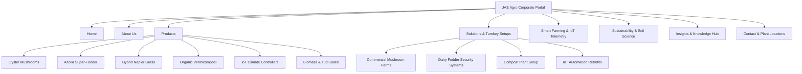

# JAS Agro Corporate Portal Redesign Strategy & Foundation

> **Document Version:** 1.0 (Pre-Implementation Strategy)  
> **Scope:** JAS Agro Corporate & AgTech Portal (Excludes `shop.jas-agro`)  
> **Objective:** Establish the verified business data baseline, authoritative information architecture, premium agricultural visual design system, and implementation guidelines.

---

## 1. Verified JAS Agro Business Data Analysis

### A. Verified & Usable Business Information
The following company data and operational activities are established in the JAS Agro codebase and physical operating footprint:

1. **Company Identity & Branding:**
   - **Legal / Operating Name:** JAS Agro
   - **Primary Brand Slogan:** *Modern Agriculture. Sustainable Growth. Smarter Farming.*
   - **Secondary Tagline:** *Empowering Agriculture Through Sustainable Science & Precision Technology.*
   - **Dedicated Mushroom Brand / Portal:** Chhatraka ([chhatraka.com](https://www.chhatraka.com/))

2. **Physical Facilities & Operational Footprint:**
   - **Corporate Headquarters & AgTech Hub:**  
     `84/123, Sector 8, Sanganer, Pratap Nagar, Jaipur, Rajasthan 302033`  
     *(Plus Code: RR39+C3 Jaipur, Rajasthan)*
   - **Biomass Processing Plant & Distribution Center:**  
     `Jas Agro Tudi Bales Plant & Warehouse, Amritsar-Jamnagar & Sangaria-Tibbi Highway Crossing, PFV8+8VW, Sangaria, 9 Sbn, Rajasthan 335063`  
     *(Plus Code: PFV8+8VW Sangaria, Rajasthan — 24/7 Operational Hub)*
   - **Primary Contact Details:**  
     Phone: `+91 73729 26623` | Email: `info@jasagro.com`

3. **Core Commercial Product Lines:**
   - **Oyster Mushroom Cultivation (*Pleurotus ostreatus / Pleurotus sajor-caju*):** High-protein gourmet mushroom spawn, sterilized straw substrate grow protocols, and climate-controlled indoor harvesting.
   - **Bio-Nutrient Azolla Aquatic Super-Fodder (*Azolla pinnata*):** Pure live mother cultures and custom shade-net pond kits providing 25–30% crude protein feed supplement for dairy cattle, poultry, and aquaculture.
   - **High-Yield Hybrid Napier Grass (*Super Napier / CO-5*):** Perennial forage stem cuttings/slips delivering multi-cut high-biomass green feed (150–200 tons/acre/year potential over 4–5 years).
   - **Bio-Active Organic Vermicompost (*Eisenia fetida* Castings):** 100% pure organic compost converted from cattle dung and agricultural residues, rich in bio-available NPK and soil humus.
   - **Smart Farm IoT Environmental Controller:** ESP32-based microcontroller hardware hubs paired with DHT22/SHT31 temperature & humidity sensors, capacitive soil probes, and 4-channel isolated solid-state relays for automated misters, exhaust fans, and pump control.
   - **Agricultural Biomass & Tudi Bales:** High-density wheat straw and fodder biomass bales supplied from the Sangaria plant for livestock and commercial applications.

4. **Turnkey Services & Solutions:**
   - Turnkey Oyster Mushroom Grow Room Engineering & Climate Retrofits
   - Azolla Fodder Cultivation Pit Construction & Inoculation Training
   - Commercial Napier Grass Estate Planning, Drip Layout & Silage Guidance
   - Industrial Vermicomposting Bed Setup & Red Worm (*Eisenia fetida*) Supply
   - Precision Micro-Climate IoT Sensor Telemetry & Automated Misting Integration

---

### B. Data Requiring Client Confirmation
These items exist as operational references or working models in the repository and must be formally verified with the client before being published as factual corporate records:

| Data Point | Current Working Reference | Verification Needed |
| :--- | :--- | :--- |
| **Year of Founding** | 2016 (referenced in timeline) | Confirm exact incorporation year / operational commencement date. |
| **Active Customer Volume** | "2,500+ Farmers & Dairies" | Confirm actual verified grower/client count or replace with qualitative impact statements. |
| **Aggregate Production Stats** | "450+ Tonnes Fodder", "120+ Tonnes Mushrooms" | Provide certified yield and processing totals across operating seasons. |
| **Active IoT Deployments** | "500+ Active Sensor Nodes" | Confirm total live hardware controllers and field deployments. |
| **Specific Regional Case Studies** | Gorakhpur (Mushroom), Karnal (Azolla), Patna (Napier) | Validate whether these are named client locations or illustrative project models. |
| **Official Certifications** | FSSAI License, NPOP Organic, ISO, State Agriculture Dept empanelments | Provide valid registration numbers and issuing authority certificates. |
| **Official Social Handles** | Facebook, Instagram, LinkedIn, YouTube, X handles | Verify verified URL slugs and active social profiles. |

---

### C. Unsupported Claims (Strictly Prohibited from Portal Copy)
The following categories of claims or aesthetics **must NOT** appear in the redesign:
- **No Fabricated Accreditations:** Do NOT state "Government of India Certified #1 AgTech Company" or invent awards.
- **No Fake Client Personas:** Do NOT generate fictional farmer profile photos or fake named testimonials without written client consent.
- **No Exaggerated Speculative Metrics:** Do NOT advertise "Guaranteed 400% ROI in 30 Days" or unrealistic biological guarantees.
- **No Industry Misrepresentation:** JAS Agro is an **authentic agricultural cultivation and AgTech company**, NOT a generic venture-capital SaaS tool, drone hardware manufacturer, solar EPC installer, or ornamental landscaping vendor.

---

## 2. Final Information Architecture (Non-Shop Portal)



### Architecture Core Objectives:
1. **Business Clarity First:** Instant comprehension within 5 seconds—visitors see real crops, real fodder systems, real hardware, and physical Rajasthan facilities.
2. **Clear Separation of Concerns:** Direct product exploration for commercial buyers, turnkey engineering for institutional/large farms, and technology telemetry for indoor growers.
3. **Frictionless Conversion:** Clear inquiry pathways (Request Technical Consultation, Download Spec Sheet, Schedule Plant Visit, WhatsApp Agronomist) on every surface.

---

## 3. Page-by-Page Section Structure

### 1. Home (`/`)
* **Purpose:** Establish corporate authority, showcase core agricultural offerings, demonstrate IoT integration, and drive inquiries.
* **Section Breakdown:**
  1. **Hero Band:** High-impact agriculture imagery + verified headline (*Modern Agriculture. Sustainable Growth. Smarter Farming.*) + dual CTAs (*Explore Solutions* / *Consult Agronomists*).
  2. **Core Impact Pillars:** Sustainable cultivation, high-protein livestock feeds, organic soil science, and automated IoT climate control.
  3. **Featured Solutions Matrix:** 4 primary solution pillars (Mushrooms, Azolla, Napier, Vermicompost) with technical highlights.
  4. **The JAS Agro Advantage / Engineering Pipeline:** From bio-culture inoculation to automated harvesting and soil enrichment.
  5. **AgTech IoT Telemetry Spotlight:** Real ESP32 microcontroller telemetry preview (Ambient Temp, RH %, Relay Misting trigger logic).
  6. **Physical Plant & Infrastructure Banner:** Jaipur Corporate HQ + Sangaria 24/7 Biomass & Tudi Bales Plant with map links.
  7. **Sustainability & Soil Organic Carbon:** Zero harmful chemicals, closed-loop water misting, and crop residue recycling.
  8. **Latest Agricultural Insights:** 3 featured agronomy articles (Mushroom cycles, Azolla dairy ratios, Soil health).
  9. **Conversion CTA Banner:** "Partner with JAS Agro for Modern, Sustainable Farming" with quick inquiry trigger.

---

### 2. About Us (`/about`)
* **Purpose:** Communicate company origin, mission, values, operational footprint, and authentic agricultural philosophy.
* **Section Breakdown:**
  1. **Hero Header:** Corporate mission, vision, and core purpose.
  2. **Our Dual Focus:** Biological science (crops, fodder, compost) paired with precision automation (microcontrollers & telemetry).
  3. **Verified Facilities & Operational Reach:** Jaipur Corporate Office & AgTech Center + Sangaria Biomass Plant.
  4. **Agronomic & Engineering Milestones:** Verified chronological progress of cultivation techniques and IoT hardware iteration.
  5. **Core Principles:** Soil rejuvenation, water conservation, commercial viability for Indian farmers, and chemical-free production.
  6. **Call to Action:** Schedule a visit to our facilities or discuss an agricultural partnership.

---

### 3. Products (`/products`)
* **Purpose:** Technical catalogue of agricultural produce, cultures, forage crops, compost, and controllers.
* **Section Breakdown:**
  1. **Category Filter Header:** All, Gourmet Mushrooms, Livestock Fodder, Soil Nutrients, IoT Hardware, Biomass.
  2. **Product Grid:**
     - *Premium Oyster Mushroom Cultivation* (*Pleurotus ostreatus / sajor-caju*)
     - *Bio-Nutrient Azolla Aquatic Fodder* (*Azolla pinnata*)
     - *High-Yield Hybrid Napier Grass* (*Super Napier / CO-5*)
     - *Bio-Active Organic Vermicompost* (*Eisenia fetida* earthworm castings)
     - *Smart Farm IoT Environmental Controller* (ESP32 micro-climate hub)
     - *Tudi Bales & Biomass Fodder* (High-density wheat straw bales)
  3. **Technical Specification Highlights:** Yield cycles, crude protein %, climate thresholds, packaging sizes.
  4. **Product Inquiry & Bulk Procurement Form.**

---

### 4. Solutions & Turnkey Setups (`/solutions`)
* **Purpose:** Tailored packages for commercial dairy farms, agri-entrepreneurs, polyhouses, and rural enterprises.
* **Section Breakdown:**
  1. **Hero Section:** "Turnkey Agricultural Engineering & Sustainable Farm Integration."
  2. **Commercial Solutions Grid:**
     - *Turnkey Indoor Mushroom Farm Setup* (Insulation, HEPA airflow, automated foggers, spawn).
     - *Dairy Feed Cost Reduction System* (Azolla shade-net pond integration + Napier forage perimeter).
     - *Commercial Vermicomposting Units* (Shaded vermi-beds, Eisenia fetida breeding stock, sieving setup).
     - *Polyhouse & Grow Room IoT Automation* (Multi-sensor node deployment, relay integration, cloud alerts).
  3. **Implementation Lifecycle:** Feasibility Assessment $\rightarrow$ Infrastructure Setup $\rightarrow$ Culture Inoculation $\rightarrow$ Training & Harvesting.
  4. **Consultation & Project Feasibility CTA.**

---

### 5. Smart Farming / IoT Telemetry (`/technology` or `/smart-farming`)
* **Purpose:** Demystify JAS Agro's AgTech hardware and demonstrate precision indoor climate automation without sounding like an abstract software startup.
* **Section Breakdown:**
  1. **Hero Header:** Precision Agriculture Powered by Industrial-Grade Microcontrollers.
  2. **Hardware Architecture Breakdown:**
     - ESP32-WROOM dual-core microcontrollers
     - Calibrated DHT22 / SHT31 temperature & relative humidity sensors
     - Capacitive corrosion-resistant soil moisture probes
     - Opto-isolated 4-channel solid-state relay controllers for pumps/misters/fans
     - Dual Wi-Fi & GSM cellular connectivity fallback
  3. **Interactive Telemetry Logic Demonstration:** Visualizing how humidity dropping below 80% triggers automated misting cycles in mushroom grow rooms.
  4. **Field Reliability & Offline Continuity:** Local microcontroller decision rules run autonomously even during grid internet outages.
  5. **Hardware Inquiry & Custom Controller Deployment Form.**

---

### 6. Sustainability & Soil Science (`/sustainability`)
* **Purpose:** Document circular agriculture practices, water efficiency, carbon conservation, and chemical-free methodologies.
* **Section Breakdown:**
  1. **Hero Header:** Regenerative Agriculture, Water Conservation & Organic Soil Restoration.
  2. **Circular Agricultural Flow:** Crop Straw $\rightarrow$ Mushroom Cultivation $\rightarrow$ Spent Substrate Vermicomposting $\rightarrow$ Nutrient-Rich Soil Replenishment.
  3. **The 4 Sustainability Pillars:**
     - *Bio-Waste & Straw Recycling* (Eliminating crop burning, utilizing wheat/paddy straw)
     - *High Water Efficiency* (Closed-loop misting and shallow Azolla pond micro-conservation)
     - *Organic Soil Carbon Enrichment* (Bio-available NPK and humic substance restoration)
     - *Zero Harmful Chemical Runoff* (100% biological pest and nutrient protocols)
  4. **Long-Term Ecological Impact Overview.**

---

### 7. Insights & Knowledge Hub (`/insights`)
* **Purpose:** Authoritative agronomy articles, practical cultivation guides, and research-backed farming insights.
* **Section Breakdown:**
  1. **Featured Article Banner:** Deep-dive into modern mushroom yields or dairy feed optimization.
  2. **Category Filter:** Mushroom Farming, Livestock Fodder, Soil Health, Agri-Tech IoT.
  3. **Verified Knowledge Base:**
     - *Oyster Mushroom Cultivation: High-Yield Indoor Agri-Business Guide*
     - *Azolla Farming for Dairy: Reducing Concentrate Feed Costs by 20–30%*
     - *Why Organic Vermicompost Restores Depleted Soil Carbon & Moisture*
     - *Hybrid Napier Grass: Year-Round Green Fodder Security Protocol*
     - *IoT Microcontrollers in Agriculture: Automated Grow Room Climate Control*
  4. **Agronomist Advisory & Newsletter Signup.**

---

### 8. Contact & Physical Facilities (`/contact`)
* **Purpose:** Immediate connection to agronomy advisors, quote requests, and transparent facility transparency.
* **Section Breakdown:**
  1. **Contact Header & Interactive Consultation Form:** Name, phone, email, farm size/type, solution of interest (Mushroom, Azolla, Napier, Compost, IoT, Tudi Bales), inquiry message.
  2. **Corporate Headquarters Card (Jaipur):** Address, Plus Code `RR39+C3`, operating hours, direct phone, Google Maps embed.
  3. **Biomass Plant & Distribution Center Card (Sangaria):** Address, Plus Code `PFV8+8VW`, 24/7 operations, direct logistical inquiries, Google Maps embed.
  4. **Direct WhatsApp & Phone Consultation Action Bar.**

---

## 4. Final Visual Design Direction (Unified JAS Agro System)

### Design Philosophy: *Earthy Modernism meets Precision AgTech*
The design language must evoke the tactile richness of modern agricultural fields (deep forest greens, rich fertile earth, fresh sprout greens, warm amber accents) combined with clean, crisp, engineering-grade typography and structured hairline cards.

```
+--------------------------------------------------------------------------------+
|                              DESIGN PALETTE TOKENS                             |
+--------------------------------------------------------------------------------+
| Primary Deep Forest:    #0B2E1E (Rich Agricultural Green)                     |
| Vibrant Crop Emerald:   #10B981 / #059669 (Vitality & Plant Health)            |
| Warm Earth / Amber:     #D97706 / #B45309 (Seed, Harvest & Sunlight Accent)    |
| Fertile Neutral Dark:   #09110D (Deep organic charcoal-green canvas)          |
| Clean Field Light:      #FAFBF7 (Subtle warm off-white, natural parchment)     |
| Hairline Border:        rgba(16, 185, 129, 0.15) (Crisp technical structure)  |
+--------------------------------------------------------------------------------+
```

### Reference Integration Breakdown:
* **Sample 1 (Agricultural Primary Direction):** Authentic field and crop photography, warm natural lighting, spacious full-bleed hero sections, and clear agricultural subject matter.
* **Sample 2 (Corporate Storytelling):** Editorial two-column layouts, clean typographic hierarchy, structured milestone timelines, and balanced white-space.
* **Sample 3 (Service & Card Structure):** Hairline-bordered cards, subtle top-border accent lines, crisp technical badge tags, and structured deliverable checklists.
* **Sample 4 (AgTech & Technology Treatment):** Precision telemetry chips, live sensor readout dials, clean monospace technical indicators (e.g. `ESP32-WROOM`, `24.5°C`, `88% RH`), and dark-slate hardware containers.
* **Sample 5 (Sustainability Interaction Patterns):** Circular flow step-cards, environmental impact pill badges, and organic soil cycle illustrations.

---

### Specific Design System Rules:

1. **Color System:**
   - **Primary:** `#0B2E1E` (Deep Forest) and `#059669` (Agricultural Emerald).
   - **Secondary / Accent:** `#D97706` (Warm Amber Harvest).
   - **Backgrounds:** Light mode uses `#FAFBF7` (natural warm canvas); Dark mode uses `#09110D` (deep fertile charcoal green) rather than generic pitch black.
   - **Borders & Dividers:** Subtle 1px translucent green-tinted hairlines (`rgba(16, 185, 129, 0.15)`).

2. **Typography System:**
   - **Headings & Display:** Contemporary geometric sans with clean authority (e.g., `Plus Jakarta Sans` or `Inter`, font-weight 700/800, tight negative tracking `-0.02em`).
   - **Body Copy:** High-legibility neutral sans (`Inter`, regular/medium 400/500, line-height 1.65).
   - **Technical Eyebrows & Specs:** High-precision monospace (`Geist Mono` or `JetBrains Mono`, uppercase, tracking `+0.05em`).

3. **Hero Section Styling:**
   - High-resolution authentic agricultural hero visuals (lush green forage, organic oyster mushroom beds, precision sensor units).
   - Deep forest gradient scrims for contrast and legibility.
   - Bold display typography with dual action buttons (High-contrast Primary Emerald + Clean Glass Secondary).

4. **Card & Container Styling:**
   - Subtle 16px to 24px rounded corners (`rounded-2xl`).
   - 1px hairline border with faint backdrop blur (`backdrop-blur-md`).
   - Micro hover states: Gentle 2px upward translate (`-translate-y-0.5`) and subtle green border glow (`border-emerald-500/40`), avoiding jarring 3D flips or heavy dropshadows.

5. **AgTech / IoT Visual Representation:**
   - Must look like **real physical agricultural hardware**: ESP32 microcontrollers, IP65 waterproof enclosures, digital probes, and live telemetry graphs.
   - Avoid generic glowing sci-fi holograms or abstract AI brains.

6. **CTA & Interactive Controls:**
   - Pill-shaped or slightly rounded primary buttons (`rounded-xl` / `rounded-full`) with solid emerald fill and crisp white text.
   - Prominent WhatsApp and direct phone inquiry triggers for Indian agricultural business users.

7. **Responsive Principles:**
   - Mobile-first layout with sticky bottom inquiry/call actions on small screens.
   - Touch-friendly tap targets (minimum 44px).
   - Clean horizontal scroll or 2-column grids for technical specifications on mobile viewports.

---

## 5. Design Principles & "Do-Not-Do" Rules

| Area | DO | DO NOT |
| :--- | :--- | :--- |
| **Visual Tone** | Earthy, credible, modern, high-grade agricultural engineering. | Neon cyberpunk, generic tech-startup SaaS, or playful cartoonish graphics. |
| **Imagery** | Real photographs of Oyster Mushrooms, Azolla ponds, Napier grass, and vermicompost beds. | Generic drone renderings, commercial skyscraper photos, or solar farm renders. |
| **Statistics** | Use verified or qualitative facts ("Multi-Cut Perennial Fodder", "High Biological Efficiency"). | Do NOT invent random statistics like "99.8% Success Rate" or "10M Farmers Served". |
| **Hardware** | Represent genuine ESP32 microcontrollers, DHT22 sensors, and relay controllers. | Do NOT display fake AI robots, flying drones, or humanoid machinery. |
| **Copywriting** | Professional, agronomically accurate, bilingual (English & Hindi support). | Hype-driven marketing jargon ("Revolutionizing the global food paradigm overnight"). |
| **Shop Boundary** | Maintain clear links to the external store (`shop.jas-agro`) as a standalone commerce portal. | Do NOT blend shopping carts into corporate storytelling or break the Shop architecture. |

---

## 6. Open Questions Requiring Client Confirmation

Before commencing UI component builds, the following 6 questions should be confirmed:

1. **Founding & History:** What is the official year of establishment for JAS Agro, and are there any specific institutional milestones (e.g. NABARD, ICAR, or State University collaborations) to highlight?
2. **Production Numbers:** What are the actual annual production capacities or batch figures for the Sangaria Biomass plant and Jaipur spawn facility?
3. **Certifications & Accreditations:** Which formal certifications (FSSAI, NPOP Organic, ISO, GST, Startup India) should have badges and registration numbers displayed in the footer/trust sections?
4. **Primary Conversion Priority:** What is the primary lead objective for website visitors: (A) Turnkey commercial farm setup consultations, (B) Bulk wholesale produce/fodder orders, or (C) IoT controller hardware inquiries?
5. **Customer Testimonials:** Can the client provide 2–4 real farmer or dairy enterprise testimonials with actual names, farm names, and locations?
6. **Domain & Subdomain Architecture:** Confirm the exact external URL routing for the Shop portal (`shop.jas-agro` / `shop.jasagro.com`) and Chhatraka mushroom portal (`chhatraka.com`).

---
*Strategy Document Prepared for JAS Agro Corporate Portal Redesign Review.*
